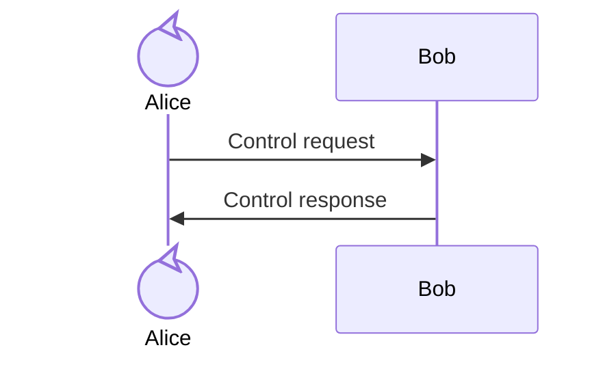
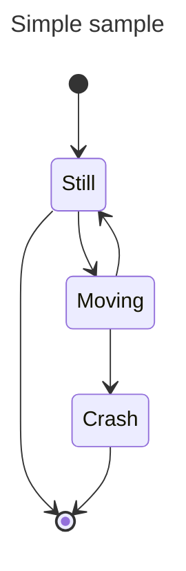

# git-flow-2

## But this is a Forked version.. P)

```mermaid
sequenceDiagram
    participant Alice@{ "type" : "control" }
    participant Bob
    Alice->>Bob: Control request
    Bob->>Alice: Control response
```

```mermaid
---
title: Simple sample
---
stateDiagram-v2
    [*] --> Still
    Still --> [*]

    Still --> Moving
    Moving --> Still
    Moving --> Crash
    Crash --> [*]
```
