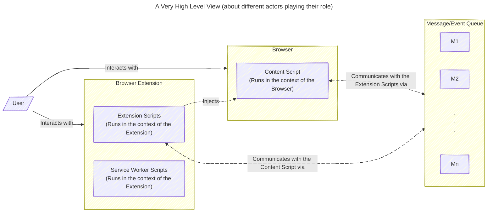
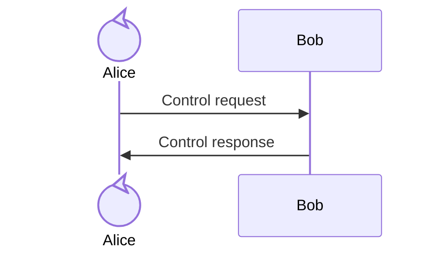
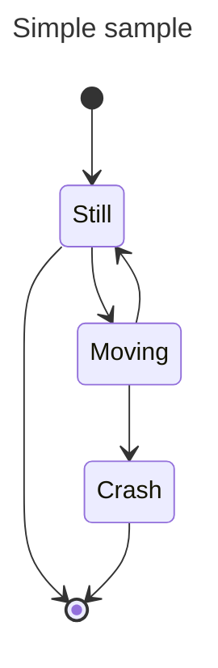
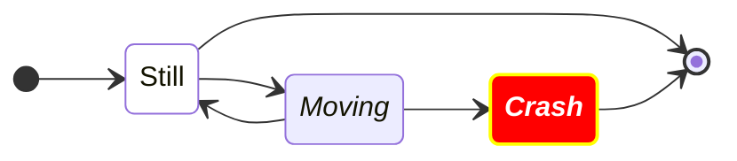

# git-flow-2

## But this is a Forked version.. P)

[](https://mermaid.live/edit#pako:eNqdlGtr2zAUhv_KQVBoITc7FydmjK5pYIPlQ2vawqJ-UOxjW6stBVnOpUn--yTbCcvGNtgHI50jvec5fmV5T0IZIfFJu92mQnOdoQ-f4BnVDj7zJIWvuMYMnjlu4JotZakh4nGMCoUGFmqpClhlbMdFAjpFrkDJDG-ouLqCUIqYJ341B8ikfPMhZSK6V2wjqKiIiWIrA3mkAqAol3V4B4s7JTcFqlebB5gGC0qmUmhLDULFV5pScf1YigK4sGAL07jVIOMqbPQ3lFQlUESXhNkZAbOtKVtwKRrYzMLOyQZX_IN33n8iAgQvpk6Aas1DhBep3gzrP4v92v78ARZzLAqWYHe2tqY8lFhiA464wlDb3mtfAeZOM7rNeLuHImUrc9aW24KMLTHzgZKOaa1-CBybzeLcgp08LbpPxrbuK7TbH-HwxXSuzIdQwIbr9AB31Z4_rM3s4iyAdqde_m76LA7meG1-GgA6tx8q5VTmeSl4yDTW4ktfTj7CmrODcaMpi-5f5Zcf0M9aw90DEzw3AmOJKrF-eVPwtzxpkUTxiPg2bJEcVc5sSPZWQYkh5UiJNTPCmJWZpoQKK1sx8U3K_KRUskxS4scsK0xUriIDuefMnHB-zpprFqGaylJo4g-rEsTfky3x3X7Hdfqe4_VHw8HI9VpkR3xn4HVczx04k4HbG_b6k2OLvFfIXmfijbzx0Bm7k6E7HvcmLYIRN_d3Xt__6jdw_AH7-1T-)

