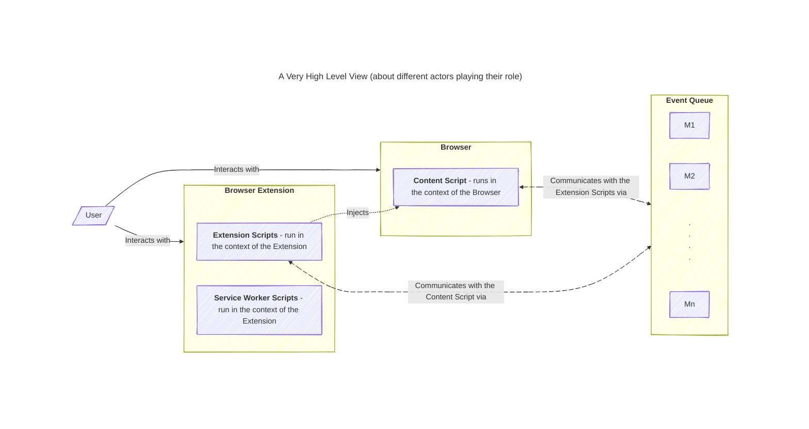

# git-flow-2

## But this is a Forked version.. P)
SVG Image

)

```mermaid
---
title: A Very High Level View (about different actors playing their role)
config:
  look: handDrawn
---
%%{init: {"flowchart": {"diagramPadding": 150}}}%%
graph LR
  subgraph B ["`**Browser**`"]
    CS["`**Content Script** - runs in the context of the Browser`"]
  end
  subgraph BE ["`**Browser Extension**`"]
    ES["`**Extension Scripts** - run in the context of the Extension`"]
    SW["`**Service Worker Scripts** - run in the context of the Extension`"]
  end
  subgraph MQ ["`**Event Queue**`"]
    direction LR
    M1
    M2
    M@{ shape: text, label: ".\n.\n.\n." }
    Mn
  end

  U[/User/] --> |Interacts with| B
  U --> |Interacts with| BE
  ES -.-> |Injects| CS
  CS e1@<--> |Communicates with the Extension Scripts via| MQ
  ES e2@<--> |Communicates with the Content Script via| MQ
  e1@{ animate: true }
  e2@{ animate: true }
```
